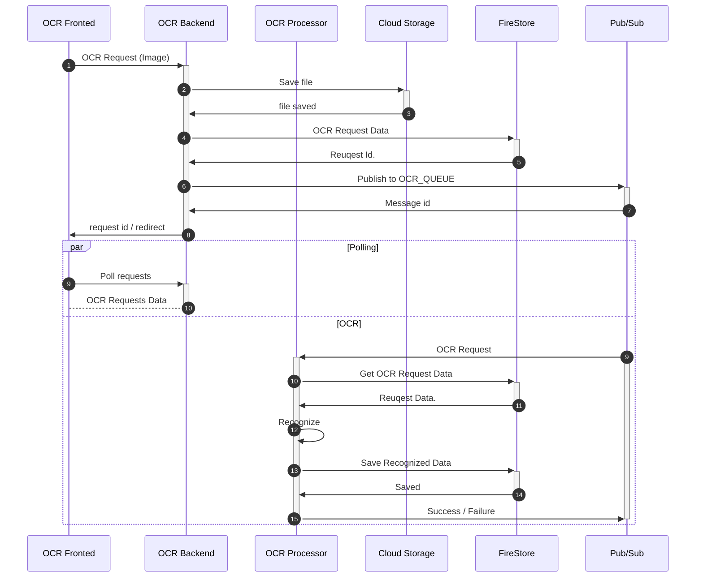

# OCR Document Management System

A modern web application for document scanning, OCR processing, and management built with Next.js 13+.

## Architecture Overview

The application follows a modern Next.js 13+ architecture with App Router, leveraging server and client components for optimal performance.

### Basic System Architecture Diagram

### Sequencee Diagram

